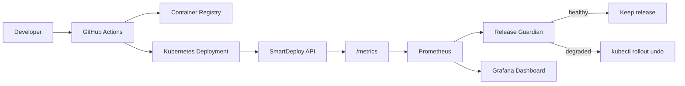

# SmartDeploy

SmartDeploy is a DevOps/SRE portfolio project that demonstrates a monitored deployment pipeline with automatic rollback.

The idea is simple: deploy a containerized service, watch real production-style signals after the release, and roll back when the release degrades latency or error rate.

## What It Shows

- Containerized application with health checks and Prometheus metrics
- Kubernetes deployment with readiness/liveness probes
- Prometheus alert rules for bad releases
- Grafana dashboard starter
- Release guardian script that checks post-deploy metrics
- CI workflow that builds, tests, scans, and prepares deployment
- Rollback command driven by observed metrics

## Architecture



## Repository Layout

```text
app/                    FastAPI demo service
k8s/                    Kubernetes manifests
monitoring/             Prometheus rules and Grafana dashboard
scripts/                Release guardian automation
.github/workflows/      CI pipeline
```

## Local Run

```bash
cd app
python -m venv .venv
source .venv/bin/activate
pip install -r requirements.txt
uvicorn main:app --reload --port 8080
```

Open:

- App: `http://localhost:8080`
- Health: `http://localhost:8080/healthz`
- Metrics: `http://localhost:8080/metrics`

## Docker

```bash
docker build -t smartdeploy-api:local ./app
docker run --rm -p 8080:8080 smartdeploy-api:local
```

## Local Observability Stack

```bash
docker compose up --build
```

Open:

- API: `http://localhost:8080`
- Prometheus: `http://localhost:9090`
- Grafana: `http://localhost:3000`

Grafana credentials:

- User: `admin`
- Password: `smartdeploy`

## Kubernetes Demo

For a local cluster, use minikube, kind, Docker Desktop Kubernetes, or k3d.

```bash
kubectl create namespace smartdeploy
kubectl apply -n smartdeploy -f k8s/
kubectl rollout status -n smartdeploy deployment/smartdeploy-api
```

Port-forward:

```bash
kubectl port-forward -n smartdeploy svc/smartdeploy-api 8080:80
```

## Simulate A Bad Release

The app supports fault injection through environment variables:

- `ERROR_RATE`: probability from `0` to `1` that `/api/orders` fails
- `EXTRA_LATENCY_MS`: artificial latency added to requests

Example bad release:

```bash
kubectl set env -n smartdeploy deployment/smartdeploy-api ERROR_RATE=0.35 EXTRA_LATENCY_MS=800
kubectl rollout status -n smartdeploy deployment/smartdeploy-api
```

Then run the guardian:

```bash
python scripts/release_guardian.py \
  --namespace smartdeploy \
  --deployment smartdeploy-api \
  --prometheus-url http://localhost:9090 \
  --error-rate-threshold 0.05 \
  --p95-latency-threshold-ms 500
```

If the metrics exceed the thresholds, the script runs:

```bash
kubectl rollout undo -n smartdeploy deployment/smartdeploy-api
```

## Next Enhancements

- Add Argo Rollouts canary analysis
- Add OpenTelemetry traces with Tempo
- Add Slack/Discord deployment reports
- Add Terraform for cloud bootstrap
- Add policy checks with Checkov or Conftest
