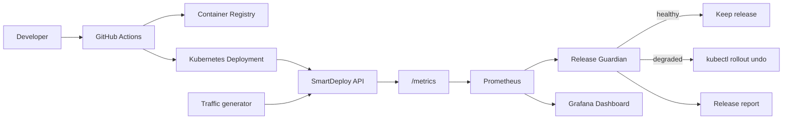

# SmartDeploy

[](https://github.com/adamlepelletier923-gif/smartdeploy/actions/workflows/smartdeploy-ci.yml)

SmartDeploy is a DevOps/SRE portfolio project that demonstrates a monitored deployment pipeline with automatic rollback.

The project does more than deploy an app: it deploys, observes production-style metrics, decides if the release is healthy, and produces a release report that explains the decision.

## What It Shows

- Containerized FastAPI application with health checks and Prometheus metrics
- Kubernetes deployment with readiness/liveness probes and rolling updates
- Prometheus alert rules for bad releases
- Grafana dashboard starter for release health
- Traffic generator to feed real demo metrics
- Release guardian with consecutive-failure detection
- Markdown release reports for healthy and degraded releases
- GitHub Actions pipeline with tests, Docker build, Trivy scan, and GHCR push

## Architecture



## Repository Layout

```text
app/                    FastAPI demo service
k8s/                    Kubernetes manifests
monitoring/             Prometheus rules and Grafana dashboard
scripts/                Release guardian and traffic generator
tests/                  API and automation tests
.github/workflows/      CI pipeline
```

## Local Run

PowerShell:

```powershell
python -m venv .venv
.\.venv\Scripts\Activate.ps1
pip install -r app\requirements.txt -r scripts\requirements.txt
uvicorn app.main:app --reload --port 8080
```

Open:

- App: `http://localhost:8080`
- Health: `http://localhost:8080/healthz`
- Metrics: `http://localhost:8080/metrics`

## Docker

```bash
docker build -t smartdeploy-api:local ./app
docker run --rm -p 8080:8080 smartdeploy-api:local
```

## Local Observability Stack

```bash
docker compose up -d --build
```

Open:

- API: `http://localhost:8080`
- Prometheus: `http://localhost:9090`
- Grafana: `http://localhost:3000`

Grafana credentials:

- User: `admin`
- Password: `smartdeploy`

## Portfolio Demo

Start the stack and generate healthy traffic:

```powershell
docker compose up -d --build
python scripts/load_generator.py --duration-seconds 60 --rate-per-second 4
```

Ask the release guardian to evaluate the current release:

```powershell
python scripts/release_guardian.py `
  --prometheus-url http://localhost:9090 `
  --watch-seconds 60 `
  --interval-seconds 10 `
  --report-file reports/healthy-release.md `
  --dry-run
```

Now simulate a bad release locally:

```powershell
$env:APP_VERSION="bad-local-release"
$env:ERROR_RATE="0.35"
$env:EXTRA_LATENCY_MS="800"
docker compose up -d --build api
python scripts/load_generator.py --duration-seconds 90 --rate-per-second 4
```

Run the guardian again:

```powershell
python scripts/release_guardian.py `
  --prometheus-url http://localhost:9090 `
  --watch-seconds 90 `
  --interval-seconds 10 `
  --consecutive-failures 2 `
  --report-file reports/bad-release.md `
  --dry-run
```

The local demo uses `--dry-run` because Docker Compose has no Kubernetes rollout history. In Kubernetes, remove `--dry-run` and the guardian will run `kubectl rollout undo`.

## Kubernetes Demo

For a local cluster, use minikube, kind, Docker Desktop Kubernetes, or k3d.

```bash
kubectl create namespace smartdeploy
kubectl apply -n smartdeploy -f k8s/
kubectl rollout status -n smartdeploy deployment/smartdeploy-api
```

Port-forward:

```bash
kubectl port-forward -n smartdeploy svc/smartdeploy-api 8080:80
```

## Simulate A Bad Kubernetes Release

The app supports fault injection through environment variables:

- `ERROR_RATE`: probability from `0` to `1` that `/api/orders` fails
- `EXTRA_LATENCY_MS`: artificial latency added to requests

Example bad release:

```bash
kubectl set env -n smartdeploy deployment/smartdeploy-api ERROR_RATE=0.35 EXTRA_LATENCY_MS=800 APP_VERSION=bad-k8s-release
kubectl rollout status -n smartdeploy deployment/smartdeploy-api
```

Then run the guardian:

```bash
python scripts/release_guardian.py \
  --namespace smartdeploy \
  --deployment smartdeploy-api \
  --prometheus-url http://localhost:9090 \
  --error-rate-threshold 0.05 \
  --p95-latency-threshold-ms 500 \
  --consecutive-failures 2 \
  --report-file reports/k8s-release.md
```

If the metrics exceed the thresholds for consecutive samples, the script runs:

```bash
kubectl rollout undo -n smartdeploy deployment/smartdeploy-api
```

## CI Pipeline

The GitHub Actions workflow:

1. Installs application and script dependencies
2. Runs the Python test suite
3. Builds the Docker image
4. Runs a Trivy image scan
5. Pushes the image to GitHub Container Registry on `main`

## Next Enhancements

- Add Argo Rollouts canary analysis
- Add OpenTelemetry traces with Tempo
- Add Slack/Discord deployment reports
- Add Terraform for cloud bootstrap
- Add policy checks with Checkov or Conftest
